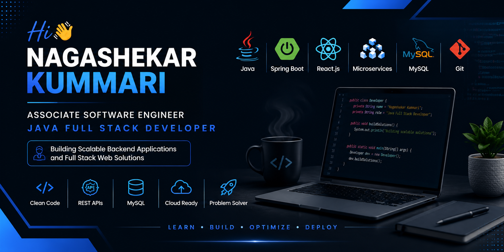

  

# 👨‍💻 About Me

I'm passionate about designing and developing scalable backend applications and modern full-stack web solutions. I enjoy solving real-world problems using Java, Spring Boot, Microservices, and React.js while continuously improving my software engineering skills.

- 🚀 Building scalable REST APIs and enterprise applications
- 🌱 Currently learning System Design, Docker, Kubernetes & AWS
- 💡 Interested in Backend Development, Microservices and Cloud Computing
- 🤝 Open to collaborating on Java & Spring Boot projects

---
## 🚀 Tech Stack

### 💻 Languages

   Java &nbsp;&nbsp;
   JavaScript &nbsp;&nbsp;
   HTML5 &nbsp;&nbsp;
   CSS3

### ⚙️ Backend

   Spring Boot &nbsp;&nbsp;
   Maven &nbsp;&nbsp;
   Hibernate &nbsp;&nbsp;
   Spring Data JPA

### 🗄 Database

   MySQL &nbsp;&nbsp;
   Firebase

### 🛠 Tools

   Git &nbsp;&nbsp;
   GitHub &nbsp;&nbsp;
   VS Code &nbsp;&nbsp;
   IntelliJ IDEA &nbsp;&nbsp;
   Postman &nbsp;&nbsp;
   Docker &nbsp;&nbsp;
   AWS

## 📌 Featured Projects

### 🏠 PG Finder
A full-stack application that helps users find PG accommodations with location-based search, authentication, and owner management.

**Tech Stack:** React.js • Spring Boot • Firebase • Google Maps • JWT

---

### 🛒 Prime Basket
A Quick Commerce platform built with Microservices Architecture for online grocery shopping.

**Tech Stack:** Java • Spring Boot • Microservices • React.js • MySQL

---

### 📄 AI Resume Optimizer
An AI-powered application that analyzes resumes, improves ATS scores, and generates optimized resumes.

**Tech Stack:** React.js • Spring Boot • AI Integration • PDF Generation

---

## 📊 GitHub Stats

---

## 📫 Connect With Me

- 💼 LinkedIn: https://www.linkedin.com/in/kummari-naga-shekar/
- 🌐 Portfolio: https://nagashekar-profile.vercel.app/
- 📧 Email: nagashekarkummari830@gmail.com

---

⭐ Thanks for visiting my profile! Feel free to explore my repositories and connect with me.
